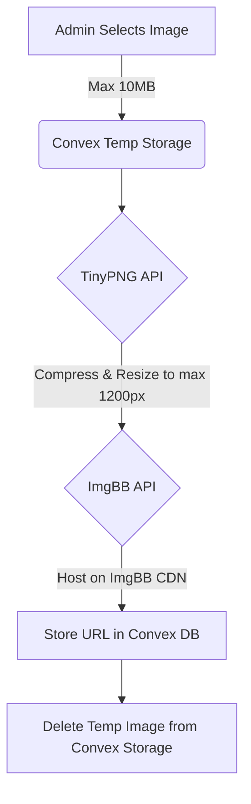

# Shape Up Fitness Website

A responsive React website for Shape Up Fitness, a fitness center in Akure, Nigeria. Built with React, TypeScript, Tailwind CSS, and Convex.

Live site: [shapeupfitnessonline.com](https://shapeupfitnessonline.com)

## Tech Stack

### Frontend

- React 18 + TypeScript + Vite
- Tailwind CSS
- Framer Motion
- Hugeicons React (`@hugeicons/react`) & React Icons (`react-icons`)
- Radix UI primitives + shadcn/ui
- goey-toast (notifications)

### Backend & Database

- Convex (database, functions, and storage)

### Image Optimization

- TinyPNG API (compression and resizing to max 1200px width)
- ImgBB API (image CDN hosting)

## Getting Started

### Prerequisites

- Node.js 18+
- npm

### Installation & Setup

1. Install dependencies:

   ```bash
   npm install
   ```

2. Start the Convex development backend:

   ```bash
   npx convex dev
   ```

3. Start the Vite development server:
   ```bash
   npm run dev
   ```

## Environment Configuration

### Frontend (.env.local)

The `.env.local` file determines which Convex backend environment is used. Comment/uncomment the corresponding block:

```env
# Development (active development, synchronized by npx convex dev)
CONVEX_DEPLOYMENT=dev:standing-parrot-671
VITE_CONVEX_URL=https://standing-parrot-671.convex.cloud
VITE_CONVEX_SITE_URL=https://standing-parrot-671.convex.site

# Production (building and deploying)
# CONVEX_DEPLOYMENT=prod:opulent-magpie-843
# VITE_CONVEX_URL=https://opulent-magpie-843.convex.cloud
# VITE_CONVEX_SITE_URL=https://opulent-magpie-843.convex.site
```

### Backend Keys

Set the required image API keys in your Convex cloud environment (dashboard or CLI):

```bash
npx convex env set TINYPNG_API_KEY your_tinypng_api_key
npx convex env set IMGBB_API_KEY your_imgbb_api_key
```

### Seeding Mock Data

To seed the database with mock products and gallery categories:

```bash
npx convex run seed:run
```

## Admin Panel

The admin panel is at `/admin`.

| Tab        | Purpose                                                      |
| :--------- | :----------------------------------------------------------- |
| Dashboard  | Overview statistics                                          |
| Products   | CRUD for products, multi-image upload with auto-compression  |
| Gallery    | Manage site and gallery images (Hero, About, Team, Services) |
| Categories | Manage gallery filter tags                                   |

## Shop & Favorites

- **Shop:** `/shop`
- **Favorites:** `/favorites`
- **Persistence:** Local storage is used for cart and wishlists (`suf-favorites` and `suf-cart`).
- **Checkout:** Handled via WhatsApp link to `wa.me/2348134460609` with a pre-filled cart description.

## Image Upload Pipeline



## Production Build

Build the production assets:

```bash
npm run build
```

## Application Routes

| Route        | Component           | Description                                   |
| :----------- | :------------------ | :-------------------------------------------- |
| `/`          | `Index.tsx`         | Home Page (Hero, Sessions, Testimonials, CTA) |
| `/about`     | `About.tsx`         | Mission, history, and trainers team           |
| `/services`  | `Services.tsx`      | Training programs and features                |
| `/pricing`   | `Pricing.tsx`       | Gym membership pricing plans                  |
| `/gallery`   | `Gallery.tsx`       | Filterable facility and workout gallery       |
| `/contact`   | `Contact.tsx`       | Contact info, location, and hours             |
| `/shop`      | `Shop.tsx`          | Products, supplements, and apparel shop       |
| `/shop/:id`  | `ProductDetail.tsx` | Product details and WhatsApp checkout trigger |
| `/favorites` | `Favorites.tsx`     | Liked items list                              |
| `/admin`     | `Admin.tsx`         | Management dashboard                          |
| `/*`         | `NotFound.tsx`      | 404 page                                      |
